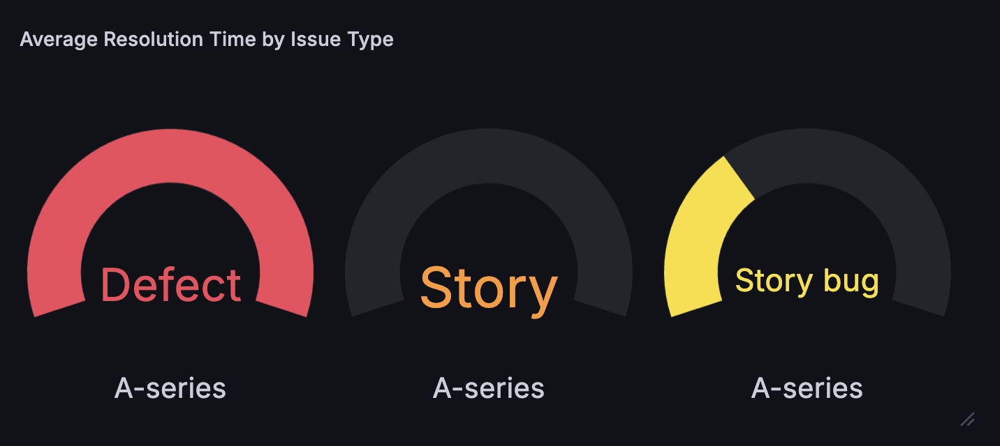
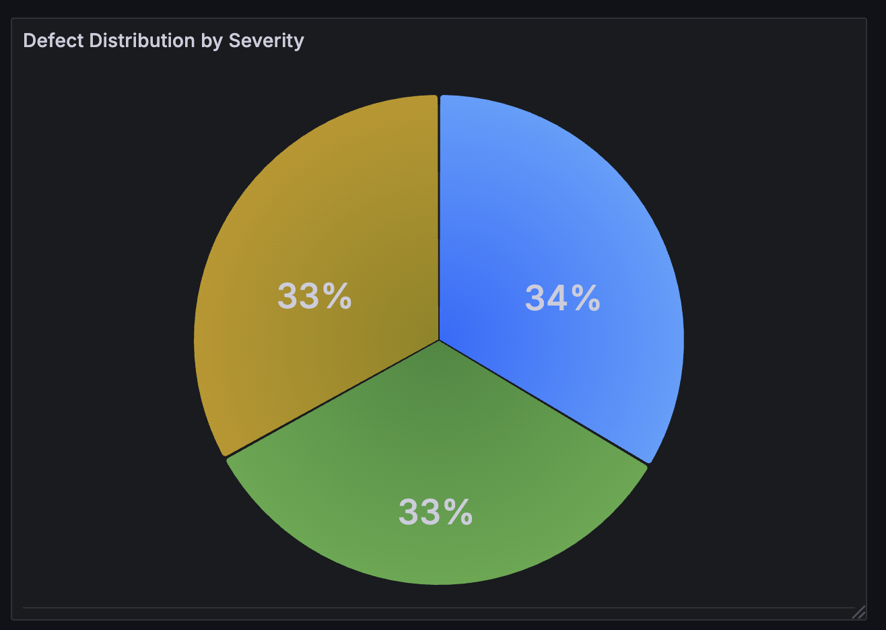
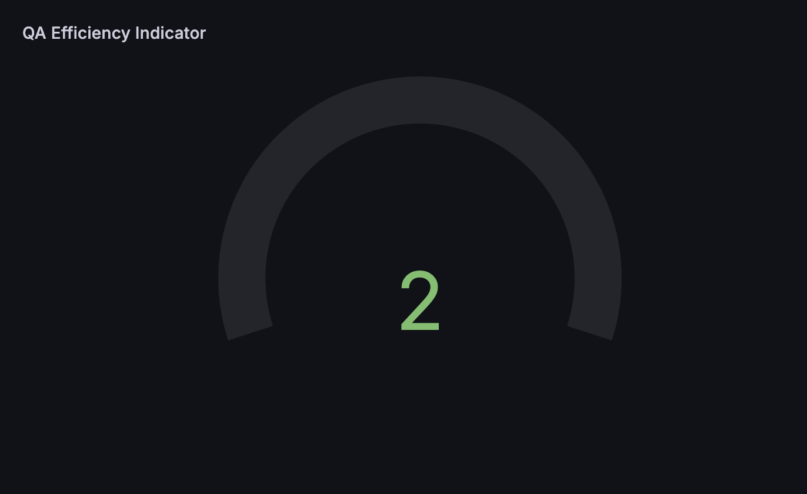

# QA Metrics Dashboard (Mocked with Grafana Test Data)

This repository contains a set of QA-related metric queries, visualized through interactive charts built with **Grafana** using the **TestData DB** mock data source.

> Note: The data is simulated for demonstration purposes. The visualizations are based on real queries I used in previous QA projects.

---

## Why this dashboard?

As a QA professional, I care not only about validating features, but also about building a **clear and objective picture of product quality**. This dashboard reflects that approach by tracking:

-  Bottlenecks in delivery
-  Defects by severity and root cause
-  QA process efficiency

---

---

---

## 📈 Included visualizations

### 1. `Average Resolution Time by Issue Type`
**Chart type**: Bar chart  
**Metric**: Average resolution time for *Defects*, *Stories*, and *Story Bugs*  
[`defect_resolution_time.sql`](queries/defect_resolution_time.sql)  

**Why this chart?**  
It helps identify which issue types take longer to resolve, offering insight into process delays.

---

### 2. `Defects by Severity`
**Chart type**: Pie chart  
**Metric**: Proportion of defects by severity level  
[`defects_by_severity.sql`](queries/defects_by_severity.sql)  

**Why this chart?**  
Clearly communicates the impact of reported bugs by highlighting the ratio of critical vs. minor issues.

---

### 3. `QA Efficiency Indicator`
**Chart type**: Gauge or bar  
**Metric**: Ratio of *Story Bugs* to total detected issues  
[`qa_efficiency.sql`](queries/qa_efficiency.sql)  

**Why this chart?**  
Helps evaluate how often issues are caught during the story phase versus later, signaling QA effectiveness.

---

## 🔧 How were they built?

All visualizations were created using:

-  `grafana-testdata-datasource` (mock data)
-  Field transformations and display name overrides in Grafana
-  Hand-picked chart types to best match each metric’s goal
-  Decisions based on my QA experience with real-world products (including blockchain and Web3 projects)

---

## Want to see it live?

I'm happy to walk you through the dashboard in a short Loom video or live call — just let me know!

---

## About me

I'm **Gisela Martínez**, a QA Engineer passionate about quality, user experience, and continuous improvement.  
I’ve worked in backend, mobile, web, and blockchain environments — and I love bringing clarity through well-structured metrics.
